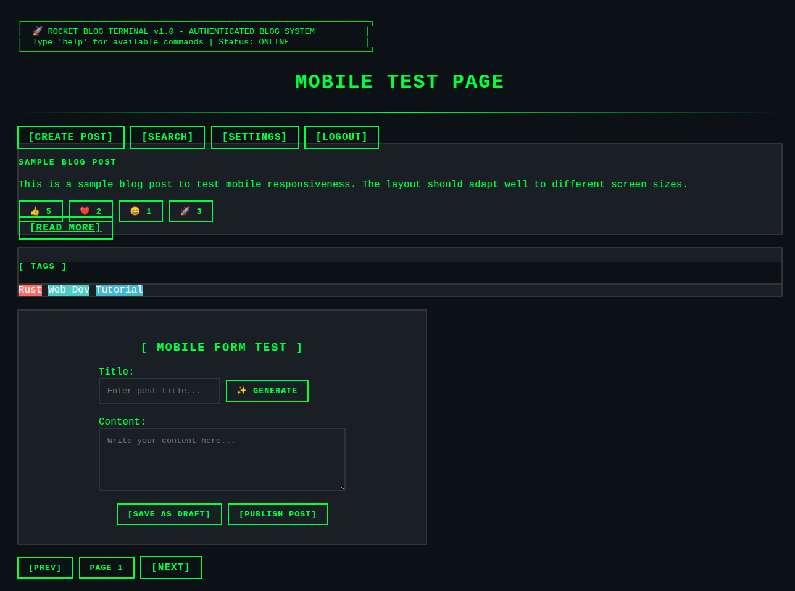
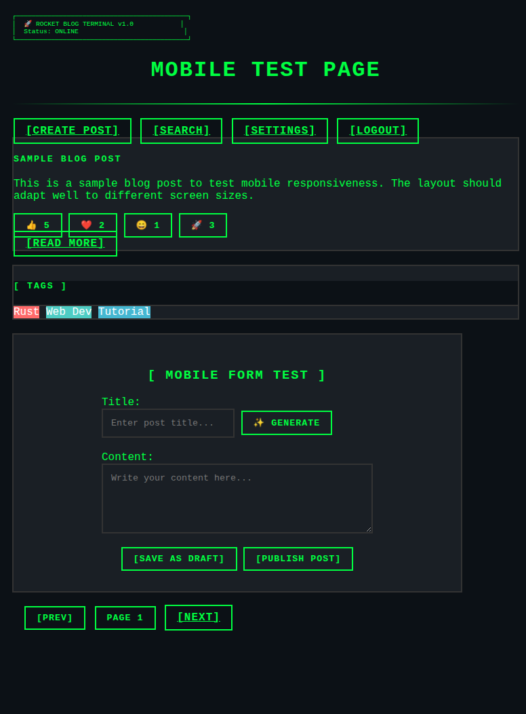
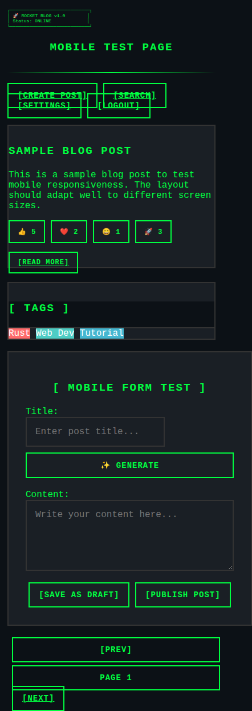

# Mobile UI Improvements Documentation

## Overview

This document describes the mobile-friendly improvements made to the Rocket Blog UI to enhance usability across all device types while maintaining the terminal aesthetic theme.

## Screenshots

### Desktop View (1200px+)


### Tablet View (768px - 1200px)


### Mobile View (375px)


## Key Improvements

### 1. Responsive Breakpoints

The CSS now includes four responsive breakpoints:

- **Extra Small**: < 576px (phones in portrait)
- **Small**: 576px - 768px (phones in landscape)
- **Medium**: 768px - 992px (tablets)
- **Large**: 992px+ (desktops)

### 2. Terminal Header Scaling

The ASCII art terminal header now scales appropriately:

```css
/* Extra small devices */
┌─────────────────────────────┐
│ 🚀 ROCKET BLOG v1.0        │
│ Status: ONLINE             │
└─────────────────────────────┘

/* Large devices */
┌─────────────────────────────────────────────────────────────────────┐
│  🚀 ROCKET BLOG TERMINAL v1.0 - AUTHENTICATED BLOG SYSTEM          │
│  Type 'help' for available commands | Status: ONLINE               │
└─────────────────────────────────────────────────────────────────────┘
```

### 3. Button Group Layouts

- **Mobile**: Buttons stack vertically with full width
- **Tablet**: Buttons wrap in flexible groups
- **Desktop**: Traditional horizontal layout

### 4. Form Improvements

- **Touch-friendly sizing**: 44px minimum button height (Apple's accessibility standard)
- **Input groups**: Stack vertically on mobile, side-by-side on larger screens
- **Font size**: 16px minimum to prevent iOS zoom
- **Better spacing**: Improved margins and padding

### 5. Grid Layout Updates

Changed from fixed Bootstrap grid to responsive:

```html
<!-- Before -->
<div class="col-md-8">
<div class="col-md-4">

<!-- After -->
<div class="col-12 col-lg-8">
<div class="col-12 col-lg-4">
```

### 6. Content Spacing

Responsive margin classes for better mobile viewing:

```html
<!-- Before -->
<div class="mx-5">

<!-- After -->
<div class="mx-2 mx-md-5">
```

## Technical Implementation

### CSS Classes Added

- `.form-input-group`: Mobile-friendly input/button combinations
- `.flex-wrap`: Flexible button group wrapping
- `.gap-2`: Consistent spacing between wrapped elements

### Media Query Structure

```css
/* Extra small devices (phones, less than 576px) */
@media (max-width: 575.98px) { ... }

/* Small devices (landscape phones, 576px and up) */
@media (min-width: 576px) and (max-width: 767.98px) { ... }

/* Medium devices (tablets, 768px and up) */
@media (min-width: 768px) and (max-width: 991.98px) { ... }

/* Large devices (desktops, 992px and up) */
@media (min-width: 992px) { ... }
```

### Template Updates

All major templates were updated for mobile responsiveness:

- `templates/blog/list.html.tera`
- `templates/blog/detail.html.tera`
- `templates/blog/create.html.tera`
- `templates/blog/edit.html.tera`
- `templates/auth/login.html.tera`

## Features Preserved

- **Terminal aesthetic**: All visual styling maintained
- **Functionality**: No JavaScript or backend changes required
- **Performance**: CSS-only improvements
- **Accessibility**: Improved touch targets and readability

## Browser Compatibility

- **iOS Safari**: Prevents zoom on form inputs
- **Android Chrome**: Touch-friendly button sizes
- **Desktop browsers**: Maintains existing experience
- **Tablets**: Optimized layouts for medium screens

## Testing

A comprehensive test page was created to validate all responsive features across different viewport sizes. The improvements ensure:

- No horizontal scrolling on any device
- Readable text at all sizes
- Touch-friendly interactive elements
- Proper content hierarchy
- Maintained terminal theme consistency

## Future Enhancements

Potential future improvements could include:

1. **Progressive Web App**: Add mobile app-like features
2. **Gesture support**: Swipe navigation for mobile
3. **Dark mode toggle**: Enhanced accessibility
4. **Offline support**: Better mobile experience
5. **Touch gestures**: Pull-to-refresh, swipe actions